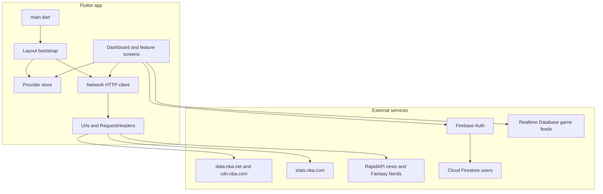

# Architecture

Hoop Fan (`hoop`) is a Flutter client for NBA scores, standings, team and player stats, news, and live game discussion. The UI is a single `MaterialApp` with imperative navigation. Screens fetch JSON directly, store it in a shared in-memory cache, and subscribe to Firebase Realtime Database for live game state.

There is no separate backend owned by this app. Statistical data comes from public NBA endpoints. Accounts, chat, and live game documents come from Firebase.

## Stack

| Layer | Choice |
| --- | --- |
| UI | Flutter, Material, Dart SDK `>=2.7.0 <3.0.0` |
| State | `provider` (`ChangeNotifier`) |
| HTTP | `http` package, JSON and XML responses |
| Charts | `charts_flutter` |
| Video | `video_player` |
| Auth and profiles | Firebase Auth and Cloud Firestore |
| Live game data | Firebase Realtime Database |
| Session cache | `shared_preferences` |
| Platforms | Android and iOS runners under `android/` and `ios/` |

Version in `pubspec.yaml` is `1.0.0+5`. The app is not published to pub.dev (`publish_to: none`).

## Runtime shape

## Directory layout

Application code lives in `lib/`.

| Path | Role |
| --- | --- |
| `lib/main.dart` | Firebase init and root `MultiProvider` |
| `lib/screens/` | Full-page views and the startup `Layout` |
| `lib/components/` | Reusable widgets grouped by domain (`games_widgets`, `player_widgets`, `teams_widgets`, `game_feed_widgets`, `social_widgets`, `standings_widgets`, `dashboard_widgets`) |
| `lib/models/` | Typed wrappers around API JSON (standings, box scores, league stats, game feed items) |
| `lib/model/user.dart` | Account model (`AppUser`) |
| `lib/json/jsons.dart` | `JsonFiles` in-memory cache |
| `lib/providers/` | User, season, progress spinner, and game-view toggles |
| `lib/services/` | HTTP client, URL builders, request headers |
| `lib/api/` | Firebase Auth, Firestore user writes, auth error messages |
| `lib/constant.dart` | Static team identity, colors, and display helpers |
| `lib/stat_definition.dart` | Glossary of NBA stat names and definitions |
| `lib/stat_calculator.dart` | Derived stats such as true shooting percentage |
| `lib/utils/` | Date formatting and form validation |
| `lib/old_files/` | Unused earlier screens, not part of the live flow |

`android/` and `ios/` are the standard Flutter platform projects. `images/` holds bundled assets. There is no `test/` suite.

## Startup

`main()` calls `Firebase.initializeApp()` and then `runApp`. `MyApp` registers five `ChangeNotifier`s and sets `Layout` as the home body:

- `JsonFiles` — cached API payloads
- `SeasonProv` — selected season and standings grouping (league, conference, division)
- `ProgressProv` — modal progress spinner flag
- `UserProv` — current `AppUser`
- `GameSettingsProv` — play-by-play, chat, and lead-tracker visibility flags

`Layout.loadData()` runs once when standings are not already cached. It loads, in order:

1. Full season schedule (`data.nba.net`)
2. League standings (`stats.nba.com`)
3. All players and all teams (`data.nba.net`)
4. League-wide base and advanced team stats (`stats.nba.com`)

Those payloads are written into `JsonFiles`. The selected date is set to today. If SharedPreferences contains a serialized user, `UserProv` is restored so the account icon shows a logged-in state. If standings fail to load, the screen shows `NoConnection`.

After bootstrap, the only home widget is `DashboardMain`.

## State

State is app-wide and in memory. There is no repository or use-case layer. Screens and widgets call `Network` and then `Provider.of<JsonFiles>` setters and getters.

`JsonFiles` is the central cache. It holds standings, schedules, rosters, news, videos, preview and recap articles, play-by-play, shot charts, player and team stat blobs, box scores, and per-game reaction counts. Many setters do not call `notifyListeners()`, so some updates rely on the calling widget calling `setState` or rebuilding from a `FutureBuilder`.

`SeasonProv` defaults to season `2022-23` and exposes a list back through `2013-14`. Standings screens switch between league, conference, and division views through this provider.

`UserProv` holds the signed-in `AppUser` and a numeric fan value. Login status is `email` being non-empty.

`GameSettingsProv` and `ProgressProv` are small UI flags. Game settings setters do not notify listeners.

## Data access

`Network` is a static HTTP helper:

- `getJson` issues a GET, optionally with headers, and decodes JSON. `FileType.xml` returns the raw body.
- `getJsonFromXml` converts XML to JSON with `xml2json` (used for injury feeds that return XML).
- `launchSite` opens a URL in an in-app web view via `url_launcher`.

Errors are printed and otherwise swallowed. Callers treat a null result as failure.

`Urls` builds every endpoint. Two season constants are hardcoded there (`2022-23` and `2022`) and are independent of `SeasonProv`. Feature screens that pass a season argument can vary the year; many league endpoints always use the constants inside `Urls`.

`RequestHeaders` supplies header maps for `stats.nba.com`, news APIs, and other hosts. NBA Stats requests need a browser-like `User-Agent` and `x-nba-stats-origin` / `x-nba-stats-token` headers or the endpoint rejects the call.

API keys for RapidAPI, Fantasy Nerds, and similar services are expected in `lib/services/apikey/key.dart` (gitignored in the original project setup) and are also referenced from `RequestHeaders`. Treat those files as secrets. Do not commit live keys.

### Upstream sources

| Source | Used for |
| --- | --- |
| `data.nba.net` | Season schedule, team list, player list, team roster, team leaders, player profile, box score, play-by-play by period, preview and recap articles, conference and division standings |
| `cdn.nba.com` | Today's scoreboard and live traditional box score JSON |
| `stats.nba.com` | League standings v3, scoreboard by date, league dash team and player stats, shooting dashboards, splits, clutch, game logs, lineups, last-N games, win probability, advanced play-by-play, box score variants, shot charts, play-event video assets |
| Fantasy Nerds / Fantasy Basketball Nerd | Injuries, news, projected lineups |
| RapidAPI news search | Team and game news queries |
| NBA.com player-movement JSON | Transaction feed |

The older RapidAPI NBA API described in the root `README.md` is commented out in `Urls`. Current traffic goes to the NBA hosts above.

## Live game path

Scoreboard cards and the game screen do not poll NBA endpoints for every play. They listen to Firebase Realtime Database:

| Path prefix | Contents |
| --- | --- |
| `gameHeader22/{gameId}` | Compact header used by dashboard cards |
| `gameData22/{gameId}` | Full game document rendered by `GameView` |
| `gamePbp22/{gameId}` | Play-by-play feed |
| `gameChat22/{gameId}` | Fan chat messages |
| `gameReactions22/{gameId}` | Reactions on play-by-play items |

`GameView` uses a `StreamBuilder` on `gameData22`. Game status `1` is scheduled, `2` is in progress, `3` is final. In-progress headers also request win probability from `stats.nba.com`. Chat writes go to `gameChat22`. This database is populated outside the app; the client reads it and appends chat.

Historical play-by-play, preview articles, and recap articles still come from `data.nba.net` and `stats.nba.com` when a screen asks for them.

## Accounts

`lib/api/config/firebase.dart` exposes the Firestore and Auth singletons and leftover emulator host strings.

`Auth.registerUser` creates an email/password user and writes `displayName`, `email`, and `favoriteTeam` to `users/{uid}` in Firestore. `Auth.loginUser` signs in, reads that document, stores the user on `UserProv`, and writes a JSON blob (including password) to SharedPreferences under the key `user`. `Auth.logoutUser` calls `signOut`.

`Layout` rehydrates `UserProv` from SharedPreferences on the next launch without calling Firebase Auth again.

## Navigation

There is no named route table and no bottom navigation shell. `DashboardMain` is the root. Feature screens are pushed with `Navigator.push` and `MaterialPageRoute`.

The title bar opens player search and the account screen. Game cards open `GameView`. Team and player pages push their own detail and stats routes. A commented floating action button on the dashboard previously linked standings, leaders, league stats, and news; those screens still exist and are reached from other entry points in the widget tree.

## Presentation

Screens own loading (`FutureBuilder`, occasional `Timer` refresh on the scoreboard). Components own slices of a screen: game cards, box-score tables, stat data tables, charts, social embeds.

Stat tables are duplicated per measure type (base, advanced, defense, usage, scoring, misc, shooting splits) rather than driven by one generic grid. Team charts follow the same pattern: one widget per shooting split (general, closest defender, dribble, touch time, shot clock).

`ConstantHelper` in `constant.dart` maps NBA team ids to name, nickname, logo URL, conference, tricode, colors, and related display data. Logos and colors on team and player pages come from this map, not from the network team list.

`stat_definition.dart` is a large map of stat abbreviations to names and definitions, aligned with the NBA stats glossary. `HelpGlossary` is a placeholder screen and does not render that map yet.

`StatCalculator` computes true shooting percentage from game or season counting stats.

## Models

Most API payloads stay as `dynamic` JSON inside `JsonFiles`. Stronger types exist where a screen walks a repeated structure:

- `LeagueStandingList` / standings rows
- `GameData` and nested team and player stats for the live game document
- Box score models: traditional, advanced, defense, four factors
- League stat row models: base, advanced, misc, scoring, opponent, four factors
- `LeadTracker`, play-by-play items, chat items, shot chart points
- Per-stat team models under `lib/models/team_stats/` (points, rebounds, efficiency, and similar)

`AppUser` serializes to Firestore and SharedPreferences. `toJson` omits the password; the login path builds its own map that includes it.

## Platforms and assets

Flutter assets are the `images/` directory. Android uses the app Gradle project and a `google-services.json` for Firebase. iOS uses the Runner Xcode project and `Info.plist`.

## Architectural notes

- Data loading is scattered. `Layout` prefetches a small set; every other screen fetches on demand and optionally writes back to `JsonFiles`.
- Season selection in the UI and the season baked into `Urls` can diverge.
- Caching is process-lifetime only, except the user JSON in SharedPreferences. There is no disk cache for stats.
- `old_files/` and large commented blocks are previous dashboard, game, and tab implementations and are not wired into `main`.
- Network failures are not surfaced as structured errors.
- Credentials for third-party APIs live in source. They should stay out of version control.
